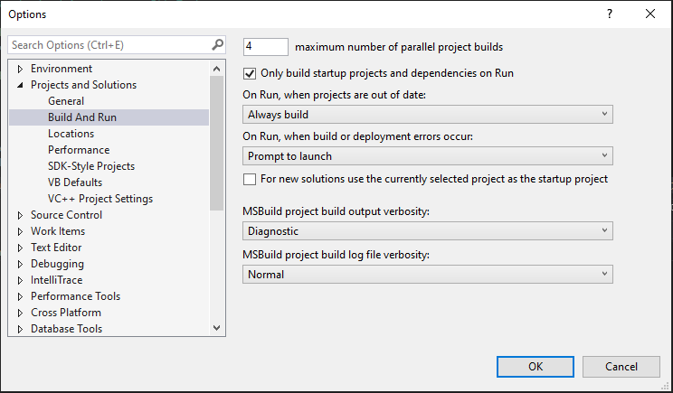

# msbuild Custom Tasks

Here there be lions and tigers and beware of msbuild monsters.

Included here are various examples of custom [MSBuild](https://docs.microsoft.com/en-us/visualstudio/msbuild/msbuild?view=vs-2019) tasks. I created each of these in an attempt to get 
[realtime output during a custom build process](https://github.com/gojimmypi/VerilogLanguageExtension/pull/25#issuecomment-640259595) 
for my [Verilog Language Extension](https://marketplace.visualstudio.com/items?itemName=gojimmypi.gojimmypi-verilog-language-extension).
Running everything and burping out the results at the end is typically not desirable on a long running process such as FPGA syntesis.

All projects are assumed to be compiled in `Debug` configuration.

See `Debug - Options - Projects and Solutions - Build and Run` for output verbosity settings:



Also, the [Project System Tools](https://marketplace.visualstudio.com/items?itemName=VisualStudioProductTeam.ProjectSystemTools) may be helpful for `View > Other Windows > Build Logging`.

## Realtime Console Output

Thanks [@rainersigwald](https://github.com/rainersigwald) for this [brilliant solution](https://github.com/microsoft/msbuild/issues/5451#issuecomment-649674873)!

See [ConsoleAppRealtime](./ConsoleAppRealtime/ConsoleAppRealtime.csproj) for the most basic working example that actually
displays messages in the Output window as they occur:

```
  <Target Name="LogStuffInRealTime" BeforeTargets="CoreCompile">
    <Exec Command="ping 127.0.0.1" YieldDuringToolExecution="True" ConsoleToMSBuild="true" StandardOutputImportance="high">
      <Output TaskParameter="ConsoleOutput" ItemName="OutputOfExec" />
    </Exec>
  </Target>
```
The key seems to be the project wrapper:

```
<Project Sdk="Microsoft.NET.Sdk">
  <PropertyGroup>
    <TargetFramework>netstandard2.0</TargetFramework>
    <RootNamespace>_5451</RootNamespace>
  </PropertyGroup>

  <!-- etc ... -->

</Project>
```

See [Target frameworks in SDK-style projects](https://docs.microsoft.com/en-us/dotnet/standard/frameworks)
and [How to: Use MSBuild project SDKs](https://docs.microsoft.com/en-us/visualstudio/msbuild/how-to-use-project-sdk?view=vs-2019)

*Note*: a `Sdk="Microsoft.NET.Sdk"` project is only _part_ of the solution. I soon discovered that although the output is sent to the build window in real time, I had a new problem
with [relentlessly running builds](./relentlessTask/README.md). Once again [@rainersigwald](https://github.com/dotnet/msbuild/issues/5486#issuecomment-655622281) to the rescue.
I'm not sure how long it would have taken me to discover that [Design Time Build](https://github.com/dotnet/project-system/blob/master/docs/design-time-builds.md) "feature" on my own. 
See also the [noDesignTimeBuild](./noDesignTimeBuild/README.md) for an example of disabling the relentless build feature.

## Final Solution

Although there are a variety of potentially interesting build tasks below, my final solution can be found in the [VerilogBuild Project](./VerilogBuild/README.md). This is the file that 
I will use in my [Verilog Language Extension](https://github.com/gojimmypi/VerilogLanguageExtension/blob/master/README.md) for [Project Templates](https://github.com/gojimmypi/VerilogLanguageExtension/tree/development-interim/ProjectTemplate).


* TODO link still pointing to `development-interim` branch.


## Realtime Console Output Default (not really realtime)

Based on the above [project file](./ConsoleAppRealtime/ConsoleAppRealtime.csproj), this one instead uses the default
XML wrapper tags generated by Visual Studio:

```
<?xml version="1.0" encoding="utf-8"?>
<Project ToolsVersion="Current" DefaultTargets="Build" xmlns="http://schemas.microsoft.com/developer/msbuild/2003">

  <!-- etc ... -->

</Project>
```
Although using the same syntax as above, this project does _not_ display output in realtime.

## Inline Parameterized Process Task

Build the `msbuildInlineProcessTask` [project](./msbuildInlineProcessTask.csproj). Notice there is no `ping` output in DOS nor IDE output window. (it _does_ run)

## Inline Parameterized Process Task with Redirected Standard Output and Wait for Exit

Build the `msbuildInlineProcessWaitForExitTask` [project](msbuildInlineProcessWaitForExitTask.csproj). Notice `ping` output in IDE output window. (no DOS popup)

## Inline Parameterized Process Task in Shell

Build the `msbuildInlineProcessShellTask` [project](msbuildInlineProcessShellTask.csproj). Notice how `ping` shows up in DOS window, no output logged to Visual Studio IDE.

## Asynchronous Inline Task

## Custom Parameterized External DLL Task

First build the `ExternalTaskLibrary` project (See [ExternalAsyncTask](./ExternalTaskLibrary/ExternalTask.cs)). 
Confirm `AsyncTask.dll` created in `.\ExternalTaskLibrary\bin\debug\` directory.

Next, build the `msbuildExternalTask` project. Note the output with `WaitDuration="10000"`:

```
1>Using "ExternalTask" task from assembly "C:\workspace\msbuildCustomTask\.\ExternalTaskLibrary\bin\Debug\ExternalTask.dll".
1>Task "ExternalTask" (TaskId:2)
1>  Task Parameter:WaitDuration=10000 (TaskId:2)
1>  Execute! Begin ExternalTask... LogMessage (TaskId:2)
1>  Waiting 10000ms (TaskId:2)
1>  ExternalTask loop! 0 (TaskId:2)
1>  ExternalTask loop! 1 (TaskId:2)
1>  ExternalTask loop! 2 (TaskId:2)
1>  ExternalTask loop! 3 (TaskId:2)
1>  ExternalTask loop! 4 (TaskId:2)
1>  Done waiting!  (TaskId:2)
1>Done executing task "ExternalTask". (TaskId:2)
```

## Custom Parameterized Asynchronous External DLL Task

First build the `ExternalAsyncTaskLibrary` project (See [ExternalAsyncTask](./ExternalAsyncTaskLibrary/ExternalAsyncTask.cs)). 
Confirm `AsyncTask.dll` created in `.\ExternalAsyncTaskLibrary\bin\debug\` directory.

Next, build the `msbuildExternalAsyncTask` project. Note the output with `WaitDuration="10000"`:

```
1>Building with tools version "Current".
1>Target "Build: (TargetId:2)" in project "C:\workspace\msbuildCustomTask\msbuildAsyncTask.csproj" (entry point):
1>Using "AsyncTask" task from assembly "C:\workspace\msbuildCustomTask\.\bin\Debug\AsyncTask.dll".
1>Task "AsyncTask" (TaskId:2)
1>  Task Parameter:WaitDuration=10000 (TaskId:2)
1>  Execute! Begin AsyncTask... LogMessage (TaskId:2)
1>  Waiting 10000ms (TaskId:2)
1>  Warming the egg pan... (TaskId:2)
1>  ThreadProc!  (TaskId:2)
1>  ThreadProc loop! 0 (TaskId:2)
1>  ThreadProc loop! 1 (TaskId:2)
1>  cracking eggs (TaskId:2)
1>  cooking the eggs ... (TaskId:2)
1>  ThreadProc loop! 2 (TaskId:2)
1>  ThreadProc loop! 3 (TaskId:2)
1>  ThreadProc loop! 4 (TaskId:2)
1>  Put eggs on plate (TaskId:2)
1>  Done waiting!  (TaskId:2)
1>Done executing task "AsyncTask". (TaskId:2)
```

Adjust the `WaitDuration` to only 100ms in the [msbuildAsyncTask.csproj](./msbuildAsyncTask.csproj) file:
```
  <Target Name="Build">
    <AsyncTask WaitDuration="100" /> 
  </Target>
```

Note how the task still runs to completion, but the output is lost.

## Exec Command UseCommandProcessor = "True" is missing cmd.exe [#5451](https://github.com/microsoft/msbuild/issues/5451)

The [msbuildIssue5451.csproj](./msbuildIssue5451.csproj) is an acknowledged bug when using `UseCommandProcessor = "True"`, see https://github.com/microsoft/msbuild/issues/5451


### Tee idea:

Run the process in a DOS shell, tee results to file, show file in IDE. See [this](https://stackoverflow.com/questions/796476/displaying-windows-command-prompt-output-and-redirecting-it-to-a-file?lq=1)

```
powershell.exe "build\vs-prog.bat 2>&1 | tee output.log"
```

## process notes:
```
process.StartInfo.RedirectStandardOutput = true;
process.OutputDataReceived += new DataReceivedEventHandler(MyOutputDataHandler);
process.StartInfo.RedirectStandardError = true;
process.ErrorDataReceived += new DataReceivedEventHandler(MyErrorDataHandler);
process.SynchronizingObject = this;
rocess.EnableRaisingEvents = true;
process.Exited += new EventHandler(MyExitedHandler);
process.Start();
process.BeginOutputReadLine();
process.BeginErrorReadLine();
```

## Further Reading:

### MSBuild project SDK
* [How to: Use MSBuild project SDKs](https://docs.microsoft.com/en-us/visualstudio/msbuild/how-to-use-project-sdk?view=vs-2019)


### Tasks
* [MSBuild concepts - Tasks - Task writing](https://docs.microsoft.com/en-us/visualstudio/msbuild/task-writing?view=vs-2019)
* [MSBuild TaskExecutionHost.cs](https://github.com/Microsoft/msbuild/blob/master/src/Build/BackEnd/TaskExecutionHost/TaskExecutionHost.cs)
* [MSBuild tasks](https://docs.microsoft.com/en-us/visualstudio/msbuild/msbuild-tasks?view=vs-2019)
* [MSBuild inline tasks](https://docs.microsoft.com/en-us/visualstudio/msbuild/msbuild-inline-tasks?view=vs-2019)
* [UsingTask element (MSBuild)](https://docs.microsoft.com/en-us/visualstudio/msbuild/usingtask-element-msbuild?view=vs-2019)
* [Microsoft.Build.Tasks Exec Class](https://docs.microsoft.com/en-us/dotnet/api/microsoft.build.tasks.exec?view=netframework-4.8)
* [Exec task Reference](https://docs.microsoft.com/en-us/visualstudio/msbuild/exec-task?view=vs-2019) [GitHub](https://github.com/MicrosoftDocs/visualstudio-docs/blob/master/docs/msbuild/exec-task.md)
* [ITask Interface](https://docs.microsoft.com/en-us/dotnet/api/microsoft.build.framework.itask?view=netframework-4.8)

### Processes and Threads
* [Asynchronous programming with async and await](https://docs.microsoft.com/en-us/dotnet/csharp/programming-guide/concepts/async/)
* [Creating threads and passing data at start time](https://docs.microsoft.com/en-us/dotnet/standard/threading/creating-threads-and-passing-data-at-start-time#passing-data-to-threads)
* [Thread.Start Method](https://docs.microsoft.com/en-us/dotnet/api/system.threading.thread.start?view=netcore-3.1)
* [Build multiple projects in parallel with MSBuild](https://docs.microsoft.com/en-us/visualstudio/msbuild/building-multiple-projects-in-parallel-with-msbuild?view=vs-2019)
* [How get exec task output with msbuild](https://stackoverflow.com/questions/8938679/how-get-exec-task-output-with-msbuild)
* [C# get process output while running](https://stackoverflow.com/questions/11994610/c-sharp-get-process-output-while-running)

### Properties
* [Common MSBuild project properties](https://docs.microsoft.com/en-us/visualstudio/msbuild/common-msbuild-project-properties?view=vs-2019)
* [MSBuild project file schema reference - UsingTask element (MSBuild)](https://docs.microsoft.com/en-us/visualstudio/msbuild/usingtask-element-msbuild?view=vs-2019)

### Target Framework and Platform
* [MSBuild target framework and target platform](https://docs.microsoft.com/en-us/visualstudio/msbuild/msbuild-target-framework-and-target-platform?view=vs-2019)
* [How to add and compile for custom 'Platform' switch for visual studio projects?](https://stackoverflow.com/questions/266028/how-to-add-and-compile-for-custom-platform-switch-for-visual-studio-projects)

### Monitoring Output
* [Process.OutputDataReceived Event](https://docs.microsoft.com/en-us/dotnet/api/system.diagnostics.process.outputdatareceived?view=netcore-3.1)
* [Process.BeginOutputReadLine Method](https://docs.microsoft.com/en-us/dotnet/api/system.diagnostics.process.beginoutputreadline?view=netcore-3.1)
* [Having the output of a console application in Visual Studio instead of the console](https://stackoverflow.com/questions/2542599/having-the-output-of-a-console-application-in-visual-studio-instead-of-the-conso)

### Other stuff
* [Exec Task Shouldn't Hang When Parent Process Fork Long Running Process #3383](https://github.com/microsoft/msbuild/issues/3383)
* [Exec Command UseCommandProcessor = "True" is missing cmd.exe #5451](https://github.com/microsoft/msbuild/issues/5451#issuecomment-648912191)
* [MSBuild post build events not running in windows 10](https://stackoverflow.com/questions/42389018/msbuild-post-build-events-not-running-in-windows-10)
* [Displaying Windows command prompt output and redirecting it to a file](https://stackoverflow.com/questions/796476/displaying-windows-command-prompt-output-and-redirecting-it-to-a-file?lq=1)

